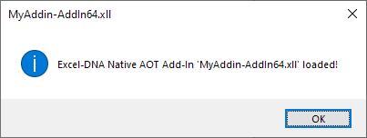
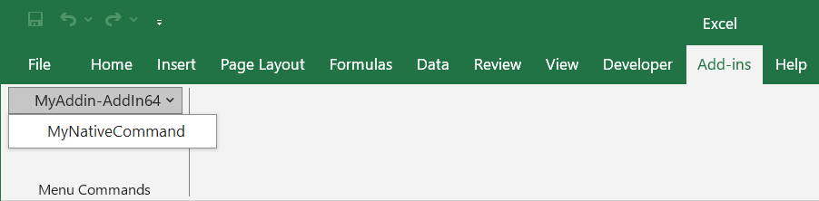
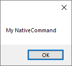
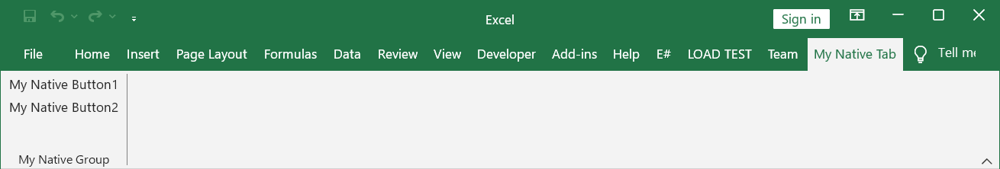
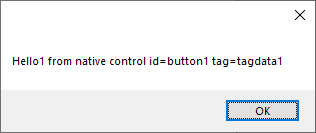
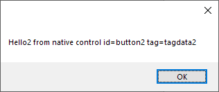
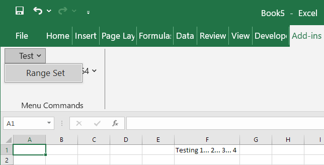
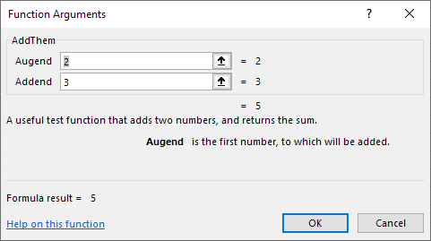

Excel-DNA can produce native 64-bit Excel add-ins, that can run on machines that don't have the .NET runtime installed, using .NET 8.0 
[Native AOT](https://learn.microsoft.com/en-us/dotnet/core/deploying/native-aot/)
deployment and **ExcelDna.AddIn.NativeAOT** package.

Publishing the following **MyAddin.csproj** C# project produces native 64-bit **MyAddin-AddIn64.xll** Excel add-in:

```xml
<Project Sdk="Microsoft.NET.Sdk">

  <PropertyGroup>
    <TargetFramework>net8.0-windows</TargetFramework>
    <ImplicitUsings>enable</ImplicitUsings>
    <Nullable>enable</Nullable>

    <RuntimeIdentifier>win-x64</RuntimeIdentifier>
    <PublishAOT>true</PublishAOT>
  </PropertyGroup>

  <ItemGroup>
    <PackageReference Include="ExcelDna.AddIn.NativeAOT" Version="0.1.0" />
  </ItemGroup>

</Project>
```

Currently supported functionality in native add-ins:

## Function

```csharp
internal class Functions
{
    [ExcelFunction]
    public static string NativeHello(string name)
    {
        return $"Hello {name}!";
    }

    [ExcelFunction]
    public static int NativeSum(int i1, int i2)
    {
        return i1 + i2;
    }
}
```

| Cell  | Formula              | Result 
| ----- | -------------------- | ------ 
| A1    | =NativeHello("AOT")  | Hello AOT!       
| A2    | =NativeSum(2, 3)     | 5
  
## Async function

```csharp
[ExcelAsyncFunction]
public static async Task<string> NativeAsyncTaskHello(string name, int msDelay)
{
    await Task.Delay(msDelay);
    return $"Hello native async task {name}";
}
```

| Cell  | Formula                             | Immediate Result | Final Result 
| ----- | ----------------------------------- | ---------------- | -------------------------
| A1    | =NativeAsyncTaskHello("Test", 5000) | #N/A             | Hello native async task Test
      
## AddIn 

```csharp
public class AddIn : IExcelAddIn
{
    public void AutoOpen()
    {
        var thisAddInName = Path.GetFileName((string)XlCall.Excel(XlCall.xlGetName));
        var message = string.Format("Excel-DNA Native AOT Add-In '{0}' loaded!", thisAddInName);

        MessageBox.Show(message, thisAddInName, MessageBoxButtons.OK, MessageBoxIcon.Information);
    }

    public void AutoClose()
    {
    }
}
```



## Command 

```csharp
[ExcelCommand(MenuText = "MyNativeCommand")]
public static void NativeCommand()
{
    MessageBox.Show("My NativeCommand");
}
```





## Ribbon 

```csharp
public class RibbonController : IExcelRibbon
{
    public string GetCustomUI(string RibbonID)
    {
        return @"
        <customUI xmlns='http://schemas.microsoft.com/office/2006/01/customui'>
            <ribbon>
                <tabs>
                    <tab id='tab1' label='My Native Tab'>
                    <group id='group1' label='My Native Group'>
                        <button id='button1' tag='tagdata1' label='My Native Button1' onAction='OnButtonPressed1'/>
                        <button id='button2' tag='tagdata2' label='My Native Button2' onAction='OnButtonPressed2'/>
                    </group >
                    </tab>
                </tabs>
            </ribbon>
        </customUI>";
    }

    public void OnButtonPressed1(RibbonControl control)
    {
        MessageBox.Show($"Hello1 from native control id={control.Id} tag={control.Tag}");
    }

    public void OnButtonPressed2(RibbonControl control)
    {
        MessageBox.Show($"Hello2 from native control id={control.Id} tag={control.Tag}");
    }
}
```







## DynamicApplication

To use the Excel COM object model from your command, function or ribbon handler, call **ExcelDnaUtil.DynamicApplication**. It returns an Excel.Application object as **IDynamic**, providing Get, Set, [] and Invoke methods:

```csharp
[ExcelFunction]
public static string NativeApplicationName()
{
    return (string)ExcelDnaUtil.DynamicApplication.Get("Name")!;
}

[ExcelFunction]
public static double NativeApplicationGetCellValue(string cell)
{
    var workbook = (IDynamic)ExcelDnaUtil.DynamicApplication.Get("ActiveWorkbook")!;
    var sheets = (IDynamic)workbook.Get("Sheets")!;
    var sheet = (IDynamic)sheets[1]!;
    var range = (IDynamic)sheet.Get("Range", [cell])!;
    return (double)range.Get("Value")!;
}

[ExcelFunction]
public static double NativeApplicationGetCellValueT(string cell)
{
    var workbook = ExcelDnaUtil.DynamicApplication.Get<IDynamic>("ActiveWorkbook");
    var sheets = workbook.Get<IDynamic>("Sheets");
    var sheet = (IDynamic)sheets[1]!;
    var range = sheet.Get<IDynamic>("Range", [cell]);
    return range.Get<double>("Value");
}

[ExcelFunction]
public static int NativeApplicationAlignCellRight(string cell)
{
    var workbook = ExcelDnaUtil.DynamicApplication.Get<IDynamic>("ActiveWorkbook");
    var sheets = workbook.Get<IDynamic>("Sheets");
    var sheet = (IDynamic)sheets[1]!;
    var range = sheet.Get<IDynamic>("Range", [cell]);
    range.Set("HorizontalAlignment", -4152);
    return range.Get<int>("HorizontalAlignment");
}

[ExcelFunction]
public static string NativeApplicationAddCellComment(string cell, string comment)
{
    var workbook = ExcelDnaUtil.DynamicApplication.Get<IDynamic>("ActiveWorkbook");
    var sheets = workbook.Get<IDynamic>("Sheets");
    var sheet = (IDynamic)sheets[1]!;
    var range = sheet.Get<IDynamic>("Range", [cell]);
    var newComment = (IDynamic)range.Invoke("AddComment", [comment])!;
    return newComment.Invoke<string>("Text", []);
}
```

| Cell  | Formula                                               | Result 
| ----- | ----------------------------------------------------- | ------ 
| C1    | 123.45                                                |        
| A1    | =NativeApplicationName()                              | Microsoft Excel       
| A2    | =NativeApplicationGetCellValue("C1")                  | 123.45
| A3    | =NativeApplicationGetCellValueT("C1")                 | 123.45
| A4    | =NativeApplicationAlignCellRight("C1")                | -4152
| A5    | =NativeApplicationAddCellComment("C1", "My comment.") | My comment.

```csharp
[ExcelCommand(MenuName = "Test", MenuText = "Range Set")]
public static void RangeSet()
{
    IDynamic xlApp = ExcelDnaUtil.DynamicApplication;

    xlApp.Get<IDynamic>("Range", ["F1"]).Set("Value", "Testing 1... 2... 3... 4");
}
```



## IntelliSense

It is possible to get limited information regarding the UDF. The information can be seen by writing the name of the function in Excel's Forumla Bar and clicking on the ```fx``` button.

```csharp
[ExcelFunction(Description = "A useful test function that adds two numbers, and returns the sum.")]
public static double AddThem(
[ExcelArgument(Name = "Augend", Description = "is the first number, to which will be added")]
double v1,
[ExcelArgument(Name = "Addend", Description = "is the second number that will be added")]
double v2)
{
    return v1 + v2;
}
```

