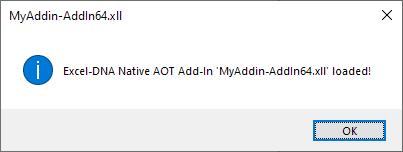

Excel-DNA can produce native 64-bit Excel add-ins, that can run on machines that don't have the .NET runtime installed, using .NET 8.0 
[Native AOT](https://learn.microsoft.com/en-us/dotnet/core/deploying/native-aot/)
deployment and **ExcelDna.AddIn.NativeAOT** package.

Publishing the following **MyAddin.csproj** C# project produces native 64-bit **MyAddin-AddIn64.xll** Excel add-in:

```xml
<Project Sdk="Microsoft.NET.Sdk">

  <PropertyGroup>
    <TargetFramework>net8.0-windows</TargetFramework>
    <ImplicitUsings>enable</ImplicitUsings>
    <Nullable>enable</Nullable>

    <RuntimeIdentifier>win-x64</RuntimeIdentifier>
    <PublishAOT>true</PublishAOT>
  </PropertyGroup>

  <ItemGroup>
    <PackageReference Include="ExcelDna.AddIn.NativeAOT" Version="0.1.0" />
  </ItemGroup>

</Project>
```

Currently supported functionality in native add-ins:

## Function

```csharp
internal class Functions
{
    [ExcelFunction]
    public static string NativeHello(string name)
    {
        return $"Hello {name}!";
    }

    [ExcelFunction]
    public static int NativeSum(int i1, int i2)
    {
        return i1 + i2;
    }
}
```

| Cell  | Formula              | Result 
| ----- | -------------------- | ------ 
| A1    | =NativeHello("AOT")  | Hello AOT!       
| A2    | =NativeSum(2, 3)     | 5
  
## Async function

```csharp
[ExcelAsyncFunction]
public static async Task<string> NativeAsyncTaskHello(string name, int msDelay)
{
    await Task.Delay(msDelay);
    return $"Hello native async task {name}";
}
```

| Cell  | Formula                             | Immediate Result | Final Result 
| ----- | ----------------------------------- | ---------------- | -------------------------
| A1    | =NativeAsyncTaskHello("Test", 5000) | #N/A             | Hello native async task Test
      
## AddIn 

```csharp
public class AddIn : IExcelAddIn
{
    public void AutoOpen()
    {
        var thisAddInName = Path.GetFileName((string)XlCall.Excel(XlCall.xlGetName));
        var message = string.Format("Excel-DNA Native AOT Add-In '{0}' loaded!", thisAddInName);

        MessageBox.Show(message, thisAddInName, MessageBoxButtons.OK, MessageBoxIcon.Information);
    }

    public void AutoClose()
    {
    }
}
```



## DynamicApplication